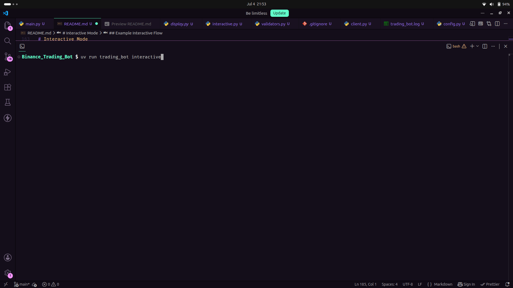

# Binance Futures Testnet Trading Bot

A Python CLI application for placing **MARKET** and **LIMIT** orders on **Binance Futures Testnet (USDT-M)** with input validation, structured logging, error handling, and an optional interactive mode.

---

## Features

- Place **MARKET** and **LIMIT** orders on **Binance Futures Testnet**
- Supports both **BUY** and **SELL**
- Input validation for:
  - symbol
  - side
  - order type
  - quantity
  - price requirements for LIMIT orders

- Clear CLI output showing:
  - order request summary
  - order response details
  - success / failure message

- Structured project layout with separation of:
  - CLI layer
  - Binance client/API layer
  - validation logic
  - logging

- Logging of:
  - order requests
  - API responses
  - errors

- Interactive prompt-based mode using **Rich** + **questionary**

---

## Tech Stack

- Python 3.12+
- `python-binance`
- `python-dotenv`
- `questionary`
- `rich`

---

## Project Structure

```text
Binance_Trading_Bot/
├── logs/
│   └── trading_bot.log
├── README.md
├── pyproject.toml
├── src/
│   └── trading_bot/
│       ├── cli/
│       │   ├── cli.py          # argparse-based CLI helpers
│       │   ├── display.py      # Rich display helpers for interactive mode
│       │   └── interactive.py  # interactive CLI flow
│       ├── client/
│       │   ├── client.py       # Binance Futures client wrapper
│       │   ├── exceptions.py   # custom exceptions
│       │   ├── models.py       # OrderRequest / OrderResult models
│       │   └── validators.py   # input validation logic
│       ├── logging/
│       │   └── config.py       # file logger configuration
│       └── main.py             # application entry point
└── uv.lock
```

---

## Supported Order Types

### 1) MARKET

Places an order immediately at the current available market price.

```bash
uv run trading_bot --symbol BTCUSDT --side BUY --type MARKET --quantity 0.04
```

### 2) LIMIT

Places an order only at the user-specified price.

```bash
uv run trading_bot --symbol BTCUSDT --side SELL --type LIMIT --quantity 0.001 --price 60000
```

or if using pip

```bash
trading_bot --symbol BTCUSDT --side BUY --type MARKET --quantity 0.04
trading_bot interactive # for interactive mode
```

---

## Setup

### 1. Clone the repository

```bash
git clone https://github.com/kgcodex/Binance_Trading_Bot.git
cd Binance_Trading_Bot
```

### 2. Install dependencies

If you are using `uv`:

```bash
uv sync
```

or if using pip

```bash
python -m venv .venv
source .venv/bin/activate
pip install .
```

---

## Binance Futures Testnet Setup

### 1. Create a Binance Futures Testnet account

Register or log in to Binance Futures Testnet.

### 2. Generate API credentials

Create:

- **API Key**
- **API Secret**

### 3. Create a `.env` file in the project root

```env
API_KEY=your_binance_testnet_api_key
SECRET_KEY=your_binance_testnet_api_secret
```

---

## How to Run

This project supports **two modes**:

- **standard CLI mode** using command-line flags
- **interactive mode** using guided prompts

---

# Standard CLI Mode

Run the bot by passing arguments directly.

## CLI Arguments

| Argument     |       Required | Description                    |
| ------------ | -------------: | ------------------------------ |
| `--symbol`   |            Yes | Trading symbol, e.g. `BTCUSDT` |
| `--side`     |            Yes | `BUY` or `SELL`                |
| `--type`     |            Yes | `MARKET` or `LIMIT`            |
| `--quantity` |            Yes | Order quantity                 |
| `--price`    | Only for LIMIT | Limit price                    |

---

# Interactive Mode

The project also includes an **interactive CLI mode** as a bonus feature.

Run:

```bash
uv run trading_bot interactive
```

The interactive mode provides:

- guided prompts for order details
- menu-based selection for side and order type
- input prompts for quantity and price
- order summary before submission
- cleaner user experience for users who do not want to remember CLI flags

---

## Example Interactive Flow

<div align="center">
  
</div>

---

## Logging

Logs are written to:

```text
logs/trading_bot.log
```

Examples

```log
2026-07-04 21:53:01,235 | INFO | trading_bot | Placing futures order | payload={'symbol': 'BTCUSDT', 'side': 'BUY', 'type': 'MARKET', 'quantity': '0.004'}
2026-07-04 21:53:02,290 | INFO | trading_bot | Order response received | response={'orderId': 19026578882, 'symbol': 'BTCUSDT', 'status': 'FILLED', 'clientOrderId': ...
2026-07-04 21:55:01,241 | INFO | trading_bot | Placing futures order | payload={'symbol': 'BTCUSDT', 'side': 'BUY', 'type': 'MARKET', 'quantity': '0.003'}
2026-07-04 21:55:02,681 | INFO | trading_bot | Order response received | response={'orderId': 19027056749, 'symbol': 'BTCUSDT', 'status': 'FILL...
2026-07-04 22:12:51,357 | INFO | trading_bot | Placing futures order | payload={'symbol': 'BTCUSDT', 'side': 'SELL', 'type': 'LIMIT', 'quantity': '0.001', 'price': '63000', 'timeInForce': 'GTC'}
2026-07-04 22:12:51,971 | INFO | trading_bot | Order response received | response={'orderId': 19031146440, 'symbol': 'BTCUSDT', 'status': 'NEW', ...
2026-07-04 22:13:52,388 | INFO | trading_bot | Placing futures order | payload={'symbol': 'BTCUSDT', 'side': 'BUY', 'type': 'LIMIT', 'quantity': '0.001', 'price': '63202', 'timeInForce': 'GTC'}
2026-07-04 22:13:52,799 | INFO | trading_bot | Order response received | response={'orderId': 19031361289, 'symbol': 'BTCUSDT', 'status': 'NEW'...
2026-07-04 22:16:11,176 | INFO | trading_bot | Placing futures order | payload={'symbol': 'BTCUSDT', 'side': 'SELL', 'type': 'MARKET', 'quantity': '0.001'}
2026-07-04 22:16:11,866 | INFO | trading_bot | Order response received | response={'orderId': 19031903984, 'symbol': 'BTCUSDT', 'status': 'FILLED ...
```

The log file captures:

- order request payloads
- Binance API responses
- validation errors
- API / network errors
- unexpected exceptions

---

## Error Handling

The bot handles the following error categories:

### Validation errors

Examples:

- invalid side
- invalid order type
- missing price for LIMIT order
- price provided for MARKET order
- non-positive quantity

### Binance API errors

Examples:

- insufficient margin
- invalid price
- invalid symbol
- rejected order

### Network / request errors

Errors raised while communicating with Binance Testnet.

---

## Assumptions

- The bot targets **Binance Futures Testnet** only.
- The current interactive mode is intentionally limited to **BTCUSDT** to keep the guided flow simple and avoid symbol-specific pricing confusion.
- LIMIT orders may return status such as `NEW`, which indicates the order was accepted and is currently open / waiting to be filled.
- MARKET orders are expected to execute immediately; the client refreshes order details after placement to retrieve updated execution status where available.

---

### Enhanced Interactive CLI UX

As the optional bonus, I implemented an interactive prompt-based mode inspired by modern CLI tools such as Vite / create-next-app style setup flows.

This mode uses:

- **questionary** for guided prompts
- **Rich** for improved terminal output

---
